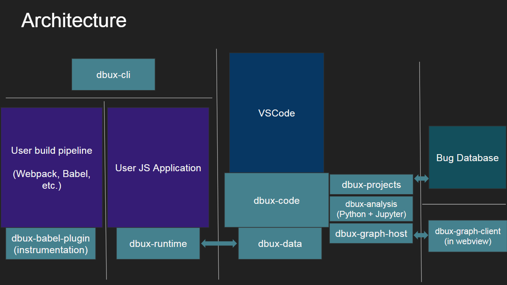

# Introduction

Dbux aims at visualizing the JS runtime and making it interactive, hopefully helping developers improve their (i) program comprehension and (ii) debugging techniques.

If you have any questions or are interested in the progress of this project, feel free to [join us on DISCORD](https://discord.gg/QKgq9ZE).

Here is a (very very early, read: crude) 1min demo video of just a small subset of the features:

# Overview

We recommend getting started with Dbux by playing around with the [Dbux VSCode Plugin](dbux-code#readme).

If you are already familiar with the Plugin, feel free to further investigate further:

1. [Adding Dbux to your build pipeline](#adding-dbux-to-your-build-pipeline)
   * You definitely want to get started with the Dbux VSCode plugin to explore a bit. Once you want to use Dbux in a more complicated build setup, the "Run with Dbux" button (and it's "Debug" button friend) can probably not (trivially) run your application anymore.
1. [Which files will be traced?](#which-files-will-be-traced)
   * When running Dbux, most relevant parts of the code will be traced. However it will not trace *everything*.
1. [Performance](#performance)
   * Recording a lot of runtime data from a program can be very slow. This section explains several major performance considerations.
1. [Known Limitations](#known-limitations)
   * Dbux is not perfect. Learn more about some of the better known imperfections here.
1. [Dbux Data Analysis](#dbux-data-analysis)
   * Dbux VSCode Plugin is (currently) the only frontend for Dbux. If you want to build your own frontend, want to further analyze your runtime data, or are just plain curious as to what kind of data is collected and what you can do with it, then this section is for you.
1. [Dbux Architecture](#dbux-architecture)
   * This section paints the bigger picture of all the components involved.
1. [Development + Contributions](#development--contributions)
   * If you are interested in Dbux development.

# Adding Dbux to your build pipeline

In order to analyze you runtime, your program must be instrumented with Dbux and injected with the [@dbux/runtime](dbux-runtime#readme). We employ [@dbux/babel-plugin](dbux-babel-plugin#readme) to do these two jobs for us.

That means that you need to "[babel](https://babeljs.io/) your program" with [@dbux/babel-plugin](dbux-babel-plugin#readme) enabled.

There are two approaches:

1. either: Use the [@dbux/cli](dbux-cli#readme) (command line interface)
   * It uses [@babel/register](https://babeljs.io/docs/en/babel-register) to instrument code on the fly.
   * This is also used by `Dbux VSCode Plugin`'s "Run with Dbux" button
   * [Read more here](dbux-cli#readme).
2. or: Add the [@dbux/babel-plugin](dbux-babel-plugin#readme) to your build pipeline manually
   * IMPORTANT: it must be the **last** entry in your `plugins` array.
   * [Read more here](dbux-babel-plugin#readme).

# Which files will be traced?

When running Dbux, most relevant parts of the code will be traced. However it will not trace *everything*.

* When using the "Run button", we trace all executed code, but ignore anything in `node_modules` and `dist` folders.
   * This logic is hard-coded in [dbux-cli/src/util/buildBabelOptions.js](dbux-cli/src/util/buildBabelOptions.js).
   * In the future we hope to support a babel config override.
* You can easily control what to instrument if you add `@dbux/babel-plugin` to your build pipeline.
   * via Babel [`test`, `include`, `exclude` and `only` config options](https://babeljs.io/docs/en/options#test)
   * via Webpack [rule conditions](https://webpack.js.org/configuration/module/#rule-conditions)

# Performance

There are many performance considerations in tracing and recording *all* activity of a program.

Main considerations include:

* In order to render the value of variables, we need to actually copy all variables anytime they are used in any way.
   * That can get very slow very fast if your code operates on large arrays, objects and strings.
   * That is why we have a few parameters to tune.
   * Currently, those parameters are hardcoded and cannot be configured from the outside.
   * Tracked in #217
* When executing *a lot of stuff* (e.g. long loops or high FPS games etc), things will get slow
   * Instead of recording *everything*, we might want to be able to choose what to record, and when.
   * For example: Dbux probably won't really work at all if you run it on a 30+FPS game.
      * In that case, we might want to be very strategic in telling Dbux to only record: (i) initialization, (ii) a select few other functions and then (iii) several frames of the gameloop for our analysis.
   * Currently, we do not have such fine-grained control over Dbux.
   * Tracked in #219
* When running a program with Dbux enabled, and also running it in debug mode (i.e. `--inspect` or `--inspect-brk`), things probably slow down even worse. Consider using the `Run` button instead of the `Debug` button, and use the Dbux built-in features unless there is a specific Debugger functionality that Dbux cannot compete with (of which arguably there might be a few, that are valuable in some circumstances).

# Known Limitations

## async/await is not yet supported

* This is currently broken so bad that it will lead to errors when trying to run JS code with `await` in it.
* NOTE: Yes, this is an absolutely vital feature of modern JavaScript and we hate to not have it working yet (despite having already spent quite some time on it).
* Tracked in #128.

## Other Syntax Limitations

The following JS syntax constructs are not supported at all or support is limited.

* Loops in general
   * Loops are traced, however the loop is not properly instrumented and many important aspects of a loop are not yet recorded.
   * Tracked in #222
* Generator functions
   * *Probably* broken so bad that it will lead to errors when trying to run JS code with generator function declarations in it.
* do-while loops
   * Not breaking other things. Just won't know much about your do-while loop.
   * Afaik, there was some issue with Babel just not wanting the do-while visitor. Have not further researched.

## Problems with Values

Because of [performance](#performance) reasons, we cannot record *everything*.

* Big objects, arrays and strings are truncated (see [performance](#performance) for more information).
* We currently do not properly handle certain built-in types (such as `Map` and `Set`) correctly, will probably not show up correctly.

## Calling `process.exit` as well as uncaught exceptions are not handled properly

* You might see a message along the lines of "Process shutdown but not all data has been sent out. Analysis will be incomplete. This is probably a crash or you called `process.exit` manually." in the console.
* `process.exit` and uncaught exceptions kill the process, even if not all recorded data has been sent out yet, as a result, you won't see all traces/contexts etc.
* If you *MUST* call `process.exit`, consider doing it after a `setTimeout` with 0.5-1s delay to be on the safe side.
   * NOTE: some frameworks that kill your process by default might require extra configuration (e.g. for `Mocha` you want to add the `--no-exit` flag)
* This is tracked in #201.

## Heisenbugs

By trying to observe a program, while definitely not intending to, you will inevitably change its behavior leading to the [observer effect](https://en.wikipedia.org/wiki/Observer_effect_(physics)) leading to [heisenbugs](https://en.wikipedia.org/wiki/Heisenbug). Here are a few already known sources for Heisenbugs:

* Property getters with [side effects](https://softwareengineering.stackexchange.com/questions/40297/what-is-a-side-effect) will be called automatically by `Dbux` (to get all that juicy runtime data) and potentially break things
   * Dbux tracks data in real-time, by reading variables, objects, arrays etc.
   * It also reads all (or at least many) properties of objects, thereby unwittingly causing side-effects of any property.
   * e.g. `class A { count = 0; get x() { return ++this.count; } }; const a = new A(); // dbux will read x when tracing the constructor call, and thus unwittingly change count`
      * -> In this case, dbux will certainly break your program, or at the very least your count will be off
   * e.g. `const o = { get z() { console.log('z called'); return 42; } } // dbux will read z and you will see an unwanted "z called" in your console, probably rendering the user confused`
   * -> The good news is that you can prevent this by writing side-effect-free getters (in most cases, getters are supposed to be side-effect-free)!
* Proxies
   * As explained in the previous point, [@dbux/runtime](dbux-runtime] iterates over and collects values of object properties automatically in its quest for gathering runtime data.
   * As discussed [here](https://stackoverflow.com/questions/36372611/how-to-test-if-an-object-is-a-proxy), [Proxies](https://developer.mozilla.org/en-US/docs/Web/JavaScript/Reference/Global_Objects/Proxy) are transparent by design. I.e. there is no general way to determine if something is a proxy or not.
   * At the same time, Proxy property access, also very much by design, often has side effects.
   * -> This means that in many scenarios where Proxies (with side effects) are in play, you might just not be able to use Dbux properly.

NOTE: There are ways to avoid these issues, for example by allowing in-line comment directives (like Eslint), but we sadly just don't have that yet. Tracked in issue #209.

## `eval` and dynamically loaded code

As a general rule of thumb - Any dynamically loaded code will currently not be traced. That is because we are not proactively scanning the application for code injections or outside code references.

Affected examples include:

* Calling `eval` on non-instrumented code
* Any kind of &lt;script> tags containing or referencing non-instrumented code

In order to trace such code, the runtime would have to:

1. (Probably) delay execution of the new piece of code
2. "Babel the code" with @dbux/babel-plugin enabled.
3. Replace the code with the instrumented version
4. Resume.

While this is not impossible, we certainly do not currently support this feature.

## SyntaxError: Unexpected reserved word 'XX'

* Example: When just running `var public = 3;` in `node` or the browser, you don't get an error. However when running the same code with [@dbux/cli](dbux-cli#readme) (which is also invoked when pressing the `Dbux VSCode Plugin`'s "Run with Dbux" button), it throws a synxtax error.
* That is because:
   1. `public` (and others) are reserved keywords and using reserved keywords is only an error in **strict mode** ([relevant discussion here](https://stackoverflow.com/questions/6458935/just-how-reserved-are-the-words-private-and-public-in-javascript)).
   2. [@dbux/cli](dbux-cli#readme) uses [@babel/register](https://babeljs.io/docs/en/babel-register) with a bunch of default settings.
   3. By default, babel treats js files as [ESModules](https://nodejs.org/api/esm.html) (or `esm`s), and ESModules have strict mode enabled by default. This is also discussed here: https://github.com/babel/babel/issues/7910
   4. NOTE: You can see the same syntax error when slightly modifying above example and running it in `node` (without Dbux) but with strict mode enabled: `"use strict"; var public = 3;`.
* You should be able to customize the babel config and disable strict mode if you please. However we recommend to just work against strict mode to begin with.

## Async Call Graph + Callback tracking

Theoretically we should be able to track all callbacks and their data flow to the call site, however we don't do that properly quite yet.

Some examples:

* When calling `setTimeout(f)`, you will see that `f` gets executed, but it's execution is not linked to the `setTimeout(f)` call that scheduled its execution.
* The same problem exists with `Promise.then(f)`, and any instance where callbacks are used.

NOTE: This link between a caller passing a callback and the execution of that callback is considered an edge in the "asynchronous call graph", an elusive feature that we are planning to support, but don't have finished yet.

The related "asynchronous call graph" feature is tracked in issue #210.

## Issues under Windows

* An entirely unrelated bug occurs **very rarely**, when running things in VSCode's built-in terminal, it might change to lower-case drive letter.
   * NOTE: Luckily, we have not seen this bug occur in quite some time.
   * This causes a mixture of lower-case and upper-case drive letters to start appearing in `require` paths
      * => this makes `babel` unhappy ([github issue](https://github.com/webpack/webpack/issues/2815))
   * Official bug report: https://github.com/microsoft/vscode/issues/9448
   * Solution: Restart your computer (can help!), run command in external `cmd` or find a better behaving terminal

# Dbux Data Analysis

`@dbux/runtime` produces fine-grained JavaScript runtime data. If you are interested in analyzing this data programmatically, we currently provide two avenues to get started:

1. [@dbux/data](dbux-data#readme) is our main data processing JavaScript module. We use this to preprocess and manage all the data before visualizing it and making it interactive in the [Dbux VSCode Plugin](dbux-code#readme).
1. [analysis](analysis) contains a few Python functions and notebooks for rudimentary analysis on extracted data for testing and development purposes. We exported the data via the (also rather crude) [dbux.exportApplicationData command](dbux-code/src/codeUtil/codeExport.js). NOTE: This approach is a lot less mature and provides a lot less pre-built functionality than [@dbux/data](dbux-data#readme).

This feature is still at somewhat of an infant stage. We track related feedback in issue #208.

# Dbux Architecture

This [monorepo](https://en.wikipedia.org/wiki/Monorepo) includes the following modules:

* [`@dbux/common`](dbux-common#readme) Collection of commonly used utilities shared among (more or less) all other modules.
* [`@dbux/babel-plugin`](dbux-babel-plugin#readme) Instruments and injects `@dbux/runtime` into a given js program when supplied as a `plugin` to Babel.
* [`@dbux/runtime`](dbux-runtime#readme) When an instrumented program runs, this module is responsible for recording and sending runtime data to the `@dbux/data` module, running on a receiving server (using `socket-io.client`). [The Dbux VSCode plugin](dbux-code#readme) hosts such a server.
* [`@dbux/cli`](dbux-cli#readme) The cli (command-line interface) allows us to easily run a js program while instrumenting it on the fly using [@babel/register](https://babeljs.io/docs/en/babel-register).
* [`@dbux/data`](dbux-data#readme) Receives, pre-processes and manages all data sent by `@dbux/runtime`. It allows us to query and analyze JS runtime data on a higher level.
* [`dbux-code`](dbux-code#readme) The Dbux VSCode extension ([VSCode marketplace link](https://marketplace.visualstudio.com/items?itemName=Domi.dbux-code)).
* [`@dbux/practice`](dbux-practice#readme) Used by `dbux-code` (but does not depend on `VSCode`) to allow practicing Dbux (and, more generally) debugging concepts and strategies on real-world bugs inside of real-world open source projects.
* [`@dbux/graph-common`](dbux-graph-common#readme), [`@dbux/graph-client`](dbux-graph-client#readme) and [`@dbux/graph-host`](dbux-graph-host#readme) Are responsible for rendering and letting the user interact with the "Call Graph" through an HTML GUI.

## Call Graph GUI Implementation

(For learning how to use the Call Graph, please refer to the [Dbux VSCode Plugin documentation](dbux-code#call-graph).)

A few more notes on the Call Graph GUI implementation:

* The Call Graph view is an HTML gui, currently most prominently seen as the "Call Graph" window inside the [Dbux VSCode Plugin](dbux-code#readme).
* Inside of `dbux-code`, the graph is hosted in [GraphWebView](dbux-code/src/graphView/GraphWebView.js), but you could also host it independently on a website, in an iframe etc.
* The Call Graph consists of three modules [`@dbux/graph-common`](dbux-graph-common#readme), [`@dbux/graph-client`](dbux-graph-client#readme) and [`@dbux/graph-host`](dbux-graph-host#readme).
* Client and host are running in separated runtimes, and they share the graph-common module for any code sharing between the two.
* We developed an IPC-first component system to easily render things on the client, while allowing us to control it from the host.
* `client` and `host` communicate via a supplied `IpcAdapter` which must provide two functions (whose implementation depends on the environment that they run in): `onMessage` and `postMessage`.

# Terminology

Terminology regarding the JavaScript runtime is either not well defined in general, or we have just not yet spent enough time finding all the definitions. That is why we try to explain some of the terminology that we came up with here (feel free to help us improve):

## Trace

TODO

## Context

TODO

* aka `executionContext`

(can probably also be called a "frame"?)

## Static trace

TODO: `staticTrace`

## Static context

TODO: `staticContext`

## Run

A "run" is an invocation of code from outside our visible (recorded) runtime. Examples include:

* Execution of a JavaScript file (often called by `node` or by the webpack bundle (which in turn is called by the underlying JS runtime environment)).
* Browser executing JavaScript of a &lt;script> tag
* Execution of a callback supplied to `setTimeout`, `setInterval`, `setIntermediate`, `Process.nextTick` etc. These callbacks are scheduled and then run by the underlying JS runtime environment.
* DOM event handler callbacks

The set of all runs comprise the "root nodes" of our Call Graph.

## Call Graph

TODO

### Asynchronous Call Graph

Currently, we only support a "synchronous call graph", meaning that **all** execution is organized in a single serial thread. While that makes sense (especially since JavaScript is inherently single-threaded), logically we want to group "threads of asynchronous contexts" together.

That means that, for now, invocation of promise callbacks (callbacks passed to `then()`, `catch()`, `finally()` etc.), and even resuming of an `async` function will result in a new `run`, seen executing serially in the Call Graph, and you cannot easily trace a single promise or the execution of a asingle `async` function. Instead, they will be cut up into multiple pieces scattered across the linear Call Graph representation, and sprinkled with other unrelated calls that happen to occur in between.

The "asynchronous call graph" feature is tracked in issue #210.

# Development + Contributions

If you are interested in Dbux development and maybe even want to participate or contribute, please see [docs/CONTRIBUTING.md](docs/CONTRIBUTING.md).
