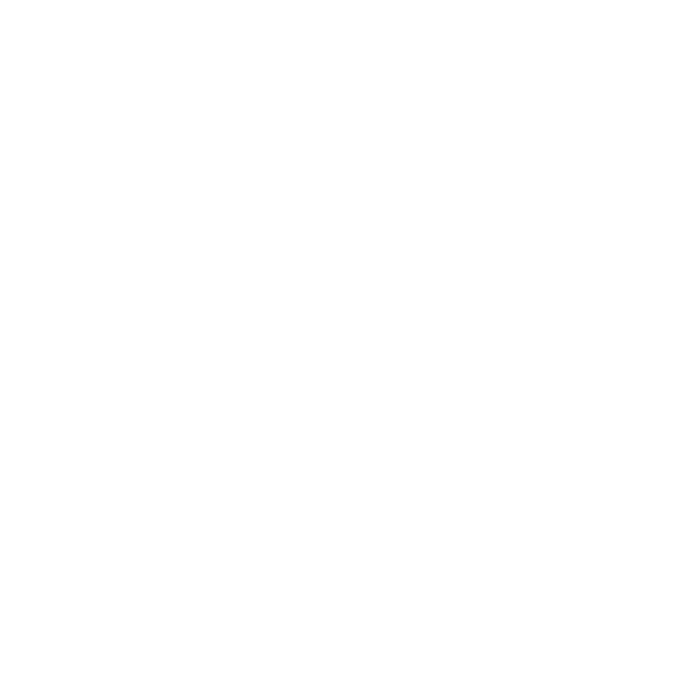
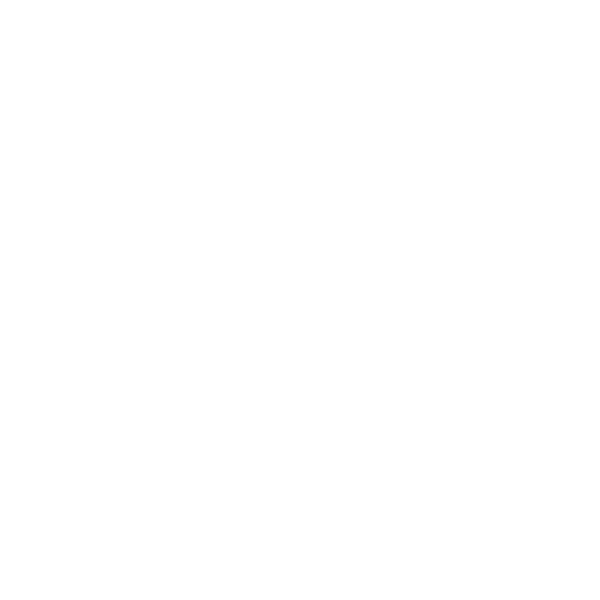
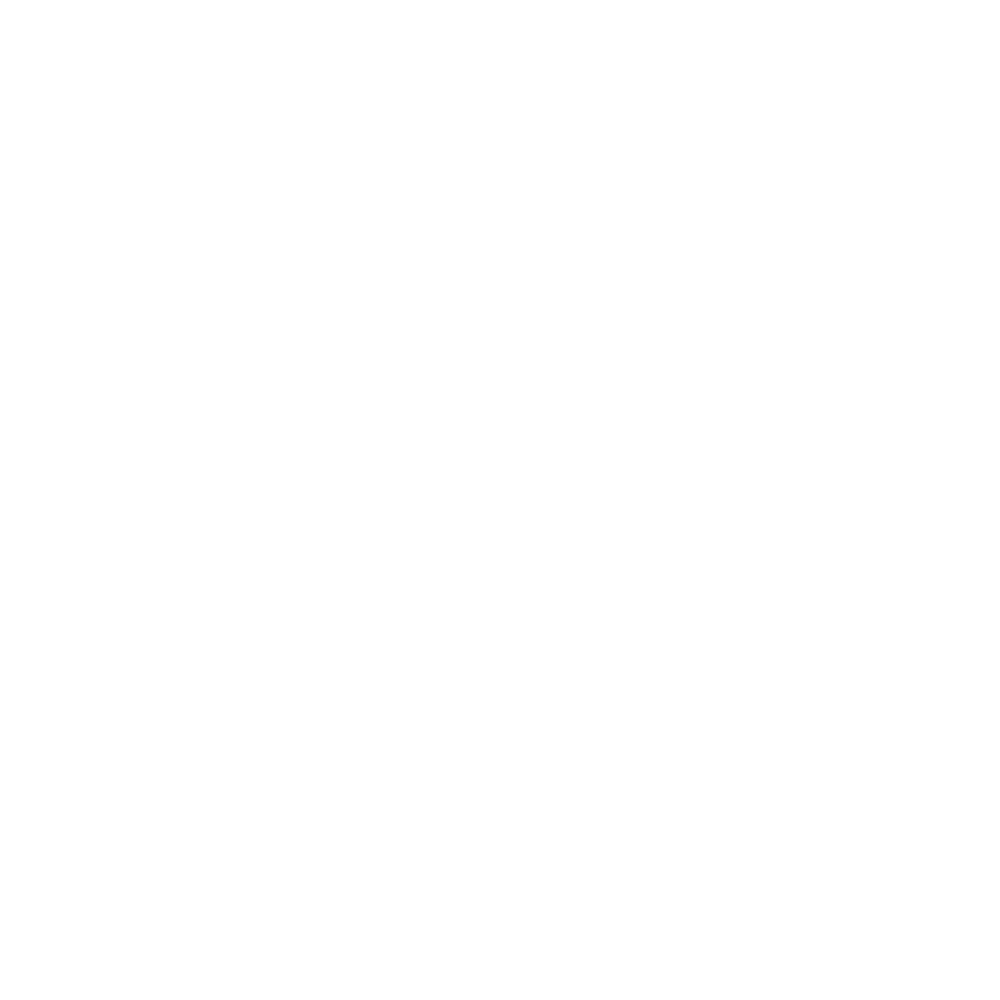
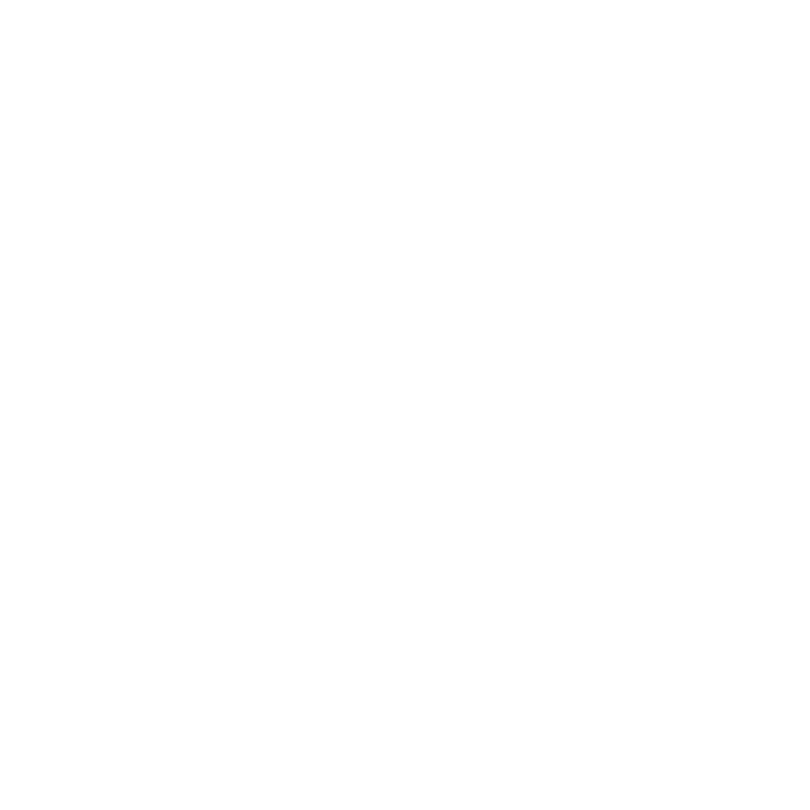
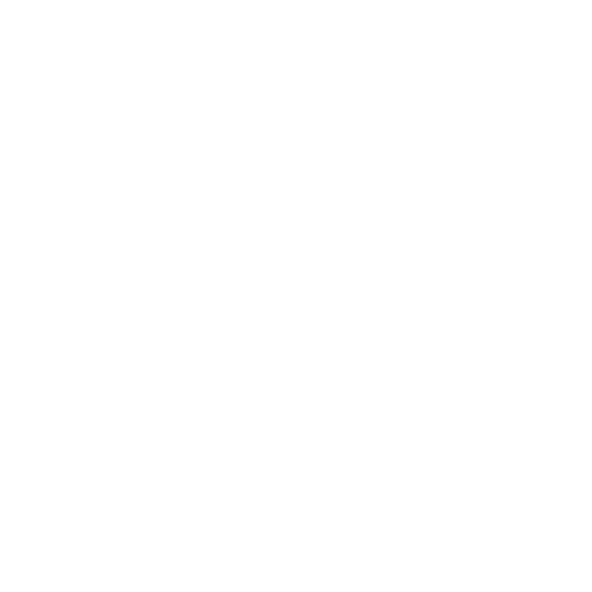
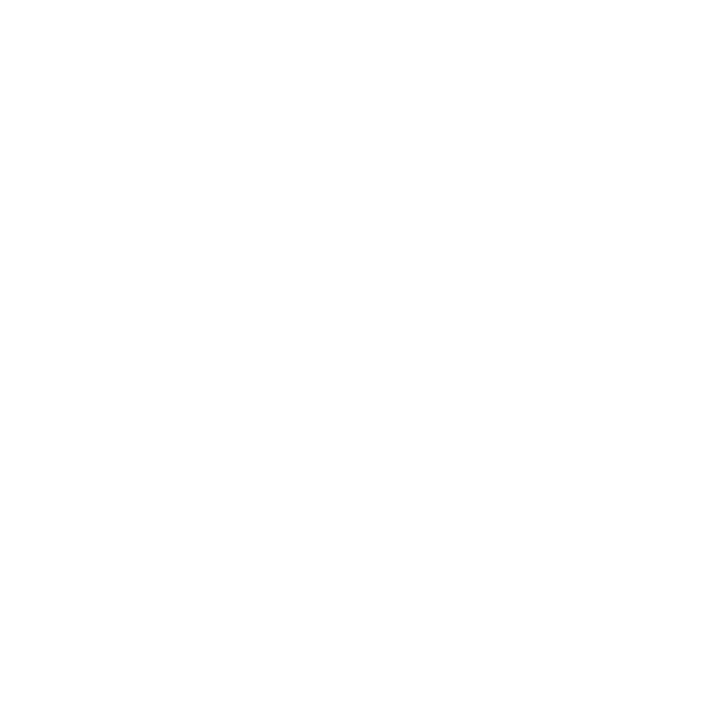

<h2>Table of Contents</h2>

1. [Installation](#installation)
2. [Usage](#usage)
3. ["Run with Dbux" and "Debug with Dbux"](#run-with-dbux-and-debug-with-dbux)
      1. [How the Run + Debug buttons work](#how-the-run--debug-buttons-work)
4. [Analysis Features](#analysis-features)
   1. [Applications](#applications)
   2. [Code decorations](#code-decorations)
   3. [Trace Selection](#trace-selection)
   4. [Trace Details](#trace-details)
   5. [Trace Details: Navigation](#trace-details-navigation)
   6. [Trace Details: Value](#trace-details-value)
   7. [Trace Details: Object Traces](#trace-details-object-traces)
   8. [Trace Details: Trace Executions](#trace-details-trace-executions)
   9. [Trace Details: Nearby Values](#trace-details-nearby-values)
   10. [Trace Details: Debug](#trace-details-debug)
   11. [ Call Graph](#img-srcdbux-coderesourcesdarkcall-graphpng-titlecall-graph-stylemax-height-2em-vertical-align-middle-background-color-1a1a1a-call-graph)
   12. [Call Graph: Visualization](#call-graph-visualization)
   13. [Call Graph: pause (pause/resume live updates)](#call-graph-pause-pauseresume-live-updates)
   14. [Call Graph: clear (show/hide already recorded traces)](#call-graph-clear-showhide-already-recorded-traces)
   15. [Call Graph: sync (toggle sync mode)](#call-graph-sync-toggle-sync-mode)
   16. [Call Graph: loc](#call-graph-loc)
   17. [Call Graph: call](#call-graph-call)
   18. [Call Graph: Search](#call-graph-search)
   19. [Finding Errors](#finding-errors)
5. [Practice debugging with "Dbux Practice"](#practice-debugging-with-dbux-practice)
6. [Commands](#commands)
7. [Configuration](#configuration)
8. [How does Dbux work](#how-does-dbux-work)

# Installation

You can one-click install the plugin from the [VSCode marketplace](https://marketplace.visualstudio.com/items?itemName=Domi.dbux-code). You can also install it from within VSCode via the "Extensions" panel.

[You can learn more about Dbux here](https://github.com/Domiii/dbux).

# Usage

In order to get started, you probably want to use the "Run with Dbux" button on some JavaScript program.

Once your program has run, you can analyze it in great detail, as described below.

If you have a build pipeline, and cannot just run it via `node myProgram.js`, refer to "[Adding Dbux to your build pipeline](../#adding-dbux-to-your-build-pipeline)".

Dbux is not perfect. You might want to read up on [known limitations](../#known-limitations).

# "Run with Dbux" and "Debug with Dbux"

The "Run with Dbux" button is the easiest way to get started with Dbux
* It is located in multiple places:
   1. In the top right (to the right of your editor tabs)
   2. In the Dbux view container at the top of the "Applications" view
      * NOTE: You have to move mouse over it to see it. That's a VSCode limitation.
   3. In the Dbux view container at the top of the "Trace Details" view
      * NOTE: You have to move mouse over it to see it. That's a VSCode limitation.
* The button calls the "*Dbux: Run current file*" command (which you can keybind if you want)

The "Debug with Dbux" button does the same thing as the Run button but with `--inspect-brk` enabled.

* Make sure to turn on VSCode's Auto Attach for this.
* For more information on VSCVode debugging, consult [the official manual on "Node.js debugging in VS Code"](https://code.visualstudio.com/docs/nodejs/nodejs-debugging).

### How the Run + Debug buttons work

* When you click either button (or use the "*Dbux: Run/Debug current file*" commands), what happens is: [@dbux/cli](../dbux-cli) runs the currently open JS file (with the [@dbux/runtime](../dbux-runtime) injected), tracing and recording runtime information as it executes.
* You can configure both buttons in your workspace or user settings. See [Configuration](#configuration) for more details.
* NOTE: Dbux architectural details are explained [here](../#dbux-architecture).

# Analysis Features

This extension provides the following visual aids and interactions to engage in JavaScript runtime analysis:

## Applications

The "Applications" view is at the top of the Dbux view.

* This allows you to manage (enable/disable) all Dbux-enabled JavaScript applications.
   * A new application will show up, once the first batch of an executed program's runtime data has been received.
   * Executions of the same entry point file will be grouped together, and replace one another, when a new execution comes along.
* You can click an application to enable/disable it.
   * Disabled applications will not be visible to inspection. Only enabled applications:
      1. Render [code decorations](#code-decorations)
      1. Allow [trace selection](#trace-selection)
      1. Show up in the [Call Graph](#call-graph)
* Activating multiple applications at once can be useful for full-stack debugging purposes.
   * When multiple applications are running at the same time, their Call Graphs will be (crudely) merged and can be viewed as one.

## Code decorations

* Code that you ran with Dbux will be rendered with decorations.
* These decorations allow us to better understand which parts of the code actually executed.
* You can toggle these decorations via the `Dbux: Hide Decorations` and `Dbux: Show Decorations` commands.
* Some explanations:
   * `f()`↱ is a *traced* function call: the function `f` is recorded and we can step into it
   * `g()` ↱ is a library or native call: the function `g` is not recorded and we cannot step into it
   * For all code decorations and their meanings, please refer to [dbux-code/src/codeDeco/traceDecoConfig.js](src/codeDeco/traceDecoConfig.js)

Examples:

* In this buggy code, we find that line 6 never executed, just from the code decorations:
   

## Trace Selection

* Code that has executed can be traced and analyzed. Executed code can be distinguished from code that did not execute from [code decorations](#code-decorations) (if enabled).
* To select a trace, place the keyboard cursor on executed code and press the "Select Trace" button.
   * NOTE: Keywords like `if` and `return` cannot currently be selected, however their conditions/arguments can.
* Press repeatedly to select surrounding traces (as shown in the gif above).

## Trace Details

Analyze and navigate through individual traces:

## Trace Details: Navigation

Navigation allows you to step through all recorded traces, similar to (but more advanced than) stepping in a traditional debugger. Navigation works by continuously updating "the currently selected trace".

TODO: short video

Important: The buttons will only show up if you select them, or hover over them with the mouse (again, this is a VSCode limitation).

Note that we are not debugging in real-time, but work on a recoding of the actual execution, allowing us to...

1. step forward and also *backward* in time, meaning that all navigation modes exist twice (one forward, one backward).
1. more easily (to some extent) take smarter (i.e. slightly less stupid) steps than the default debugger

Here are all the buttons:

   `Go to start/end of context`

* Jump to the start/end of the current [context](../#context) (function or file)
* When pressed again, steps out to caller (which we also call "parent")

  `Go to previous/next function call in context`

* Jump to previous/next *traced* function call ↱ before/after the currently selected trace.
   * Note that library or native calls ↱ are not traced and thus will be skipped by this button.
* When pressed again, steps into that function (aka [context](../#context) aka "child context of this context").
* NOTE: Things might be a bit off in case of [getters and setters](https://www.w3schools.com/js/js_object_accessors.asp)
   * Getters and setters work, but navigation is a bit less intuitive.
   * Since getters and setters don't have a clearly identifyable caller trace, they will need some more development work before they will be fully smoothed out.

  `Go to previous/next "non-trivial" trace in context`

* Jump to previous/next "non-trivial" trace in [context](../#context) (function or file)
* Stepping would be a lot of work, if we tried to step through every single expression.
* That is why Dbux uses some basic heuristics to ignore some of the more "trivial traces".
   * Ex1: In case of `a.b`, it will step to `a.b`, but it will not step to `a`.
   * Ex2: In case of `o.f(x, y);`, it will step straight to `o.f(x, y)`, while ignoring `o`, `o.f`, `x` and `y` (all four of which are also all traced expressions, just a bit more "trivial" than the call expression itself).
* (Dev note: we internally determine "trivial traces" as traces of `TraceType.ExpressionValue`.)

  `Go to previous/next execution of the same trace`

* If a piece of code was executed multiple times (because a function was called multiple times, or there is a loop etc), these buttons allow you to jump between the traces of those different executions.
* These buttons step through all [`Trace Executions`](#trace-executions) of the currently selected `trace`'s `staticTrace`. [Read more on Dbux terminology here](../#trace)

  `Go to previous/next trace (unconditionally)`

* Go to previous/next trace, no matter what. This navigation method does not filter out "trivial traces", and it also moves in and out of contexts, if that is where the previous/next trace is.
* These buttons provide the most granular navigation option.
* Recommendation:
   * Use these buttons if you want to follow the exact control flow of your program, visiting every expression and statement, not ignoring anything; especially useful for convoluted one-liners or otherwise compressed, complex expressions and statements that are not intuitive to disentangle.
   * Only use these buttons for short distances, as there is usually a lot of trivial traces to step through, slowing navigation down a lot.

## Trace Details: Value

* If your currently selected trace is an expression with a value that is `!== undefined`, that value will be rendered here.
* You can investigate further by clicking on the "Value" node.
* Further reading:
   * You might want to read up on Dbux's [value limitations and problems](../#problems-with-values).

## Trace Details: Object Traces

`Object Traces` lists all occurences of an object and allows us to track its evolution throughout the execution of the application, like in the example below.

Specifically: if the currently selected trace's value is an object (or non-primitive), `Object Traces` will list all traces of values that are equal to that value ("equal" as defined by [JavaScript's built-in `Map`'s key equality algorithm](https://developer.mozilla.org/en-US/docs/Web/JavaScript/Reference/Global_Objects/Map#Key_equality)).

There is a "Highlight in Call Graph" button that appears when hovering over the "Object Traces" node, at the right-hand side. It expands and highlights all contexts where this object was used in the call graph.

## Trace Details: Trace Executions

`Trace Eexecutions` lists the values of all executions of the currently selected "piece of code".

E.g. if you currently selected some trace `f(x)`, then you would see all executions (and their values) of `f(x)` here.

You can select (jump to) any trace inside of this list by clicking on it.

Since this can be a lot of traces, we provide a few (currently still rather crude) grouping methods (as seen in the gif below).

In Dbux terminology: `Trace Executions` lists all `traces` of the currently selected `trace`'s `staticTrace`. [Read more on Dbux terminology here](../#trace)

TODO: hof1.js

## Trace Details: Nearby Values

`Nearby Values` lists *all* traces of the current [context](../#context) (function or file) that are expressions and whose value is not `undefined`.

You can select (jump to) any trace inside of this list by clicking on it.

We want to add some grouping to this feature. That is being worked on and tracked [here](https://github.com/Domiii/dbux/issues/264).

**Recommendations**: `Nearby Values` is very useful to...

* understand which values were generated in what order.
* decipher complex one-liners (see screen grab below).

## Trace Details: Debug

This renders raw data related to the selected trace.

This is generally only useful for contributors, the very curious or those who work on dynamic JS runtime data analysis.

##  Call Graph

The  call graph renders a bird's eye overview over all executed files and functions.

As an analogy, I would say that the call graph is like (a rather crude) "Google Maps" while the [trace details view](#trace-details) is (a rather crude) "Google Street View" of your application's execution. Together they offer a multi-resolutional interactive tool to see and find everything that is going on in your application.

## Call Graph: Visualization

The call graph renders a linear timeline of your JavaScript application in the vertical dimension.

The horizontal dimension grows with execution depth.

At the outer most level, you see individual "[Run](../#run)" nodes.

Each run contains all (visible/recorded) "[Context](../#context)" sub trees, that is all invocations of traced functions and files.

Call graph visualizations have many uses. E.g.:

* overview the complex system that is our application.
* quickly identify points of interests in code that is not our own.
* visualize [recursion trees](https://www.google.com/search?q=recursion+trees), like in the example below:

TODO: fibonacci1.js

## Call Graph: pause (pause/resume live updates)

* Dbux keeps recording and rendering all code execution in real-time, as long as an application (or website) is running.
* During analysis, once we have recorded the bug (or other event of interest), we might not be interested in further updates.
* Use the 🔴 button to pause/resume the rendering of new incoming data, so we can focus on what we already have.
   * NOTE: You might be tempted into thinking that pausing with this button will stop all recording, however that is not what happens. Currently, Dbux keeps on recording for as long as the application is running. This button only hides that new data behind a single "Hidden Node". That inability to completely pause recording, can make things very slow and thus make debugging of games and other kinds of high performance applications very difficult. [You can read more about performance considerations here](../#performance).

## Call Graph: clear (show/hide already recorded traces)

* `clear` is useful for removing clutter when investigating a bug that does not appear immediately, or is not part of the initialization routine.
* For example, when investigating a bug that happens after pressing some button in your application, you can:
   1. wait for the application to finish initialization and for the "buggy button" to show up
   1. press `clear`
   1. press the buggy button
   1. (if necessary) wait until the bug occurs
   1. press 🔴 (pause).
   * -> This lets you completely isolate the code that was executed when clicking that button, render only the relevant sub graph, while removing (hiding) all kinds of unrelated clutter.

## Call Graph: sync (toggle sync mode)

* `sync` mode makes sure that while you select traces in and navigate through your code, the selected trace's context is always automatically expanded and in clear sight.

## Call Graph: loc

Show/hide locations in context nodes.

You can click it to go there.

## Call Graph: call

Show/hide caller traces of all contexts that are function invocations.

You can click it to go there. You can `CTRL/Command` + `Click` it to select it.

## Call Graph: Search

Simple text search. Currently only matches the context node's title (aka `staticTrace.displayName`).

The search implementation is located in [dataProviderUtil.searchContexts](../dbux-data/src/dataProviderUtil.js).

## Finding Errors

If a thrown error has been recorded, the "Error" button will show up at the top right in VSCode (to the right of the editor tabs).

When you click it, it takes you right to the error.

If there are multiple errors, it should take you to the first error in your program.

# Practice debugging with "Dbux Practice"

# Commands

TODO: clean this up and update all missing commands
TODO: explain keyboard shortcuts

How to execute VSCode commands:
1. Press `CTRL/Command + Shift + P`
1. Search for a command... (just type)
1. Select the command (`Enter`)

A rough outline of (hopefully all) commands:

<!-- dbux:codeCommands start -->
| Command                                  | Title                               | Description                    |
| ---------------------------------------- | ----------------------------------- | ------------------------------ |
| dbux.backendLogin                        | Dbux: Backend Login                 | Run current file               |
| dbux.debugFile                           | Dbux: Debug current file            | Run current file with debugger |
| dbux.exportApplicationData               | Dbux: Export application data       |                                |
| dbux.hideDecorations                     | Dbux: Hide all decorations          |                                |
| dbux.hideGraphView                       | Dbux: Hide Call Graph               |                                |
| dbux.runFile                             | Dbux: Run current file              |                                |
| dbux.selectTrace                         | Dbux: select trace                  |                                |
| dbux.showDecorations                     | Dbux: Show decorations              |                                |
| dbux.showGraphView                       | Dbux: Show Call Graph               |                                |
| dbux.showHelp                            | Dbux: Help                          |                                |
| dbux.systemCheck                         | Dbux: Check System Dependencies     |                                |
| dbux.toggleErrorLog                      | Dbux: Toggle all error log          |                                |
| dbux.toggleNavButton                     | Dbux: Toggle all navigation buttons |                                |
| dbux.togglePracticeView                  | Dbux: Toggle Practice View          |                                |
| dbuxProjectView.node.showBugIntroduction | Show introduction                   |                                |

<!-- dbux:codeCommands end -->

# Configuration

These are all currently supported configuration parameters (mostly for the "Run with Dbux" and "Debug with Dbux" buttons/commands):

(You can open configuration via `CTRL/Command + Shift + P` -> "Open {User,Workspace} Settings")

<!-- dbux:codeConfig start -->
| Entry                  | Type     | Default                | Description                                                                                                                                                                 | Scope      |
| ---------------------- | -------- | ---------------------- | --------------------------------------------------------------------------------------------------------------------------------------------------------------------------- | ---------- |
| dbux.run.dbuxArgs      | "string" | "--esnext"             | "Custom `dbux run` command options. You can find a list of all available dbux command options in https://github.com/Domiii/dbux/blob/master/dbux-cli/src/commandCommons.js" | "resource" |
| dbux.run.nodeArgs      | "string" | "--enable-source-maps" | "Custom node options passed to node when running the program."                                                                                                              | "resource" |
| dbux.run.programArgs   | "string" | ""                     | "Custom program arguments, available to the program via `process.argv`."                                                                                                    | "resource" |
| dbux.run.env           | "object" | {}                     | "Custom program environment variables available via `process.env` (probably not working yet)."                                                                              | "resource" |
| dbux.debug.dbuxArgs    | "string" | "--esnext"             | "Custom `dbux run` command options. You can find a list of all available dbux command options in https://github.com/Domiii/dbux/blob/master/dbux-cli/src/commandCommons.js" | "resource" |
| dbux.debug.nodeArgs    | "string" | ""                     | "Custom node options passed to node when running the program."                                                                                                              | "resource" |
| dbux.debug.programArgs | "string" | ""                     | "Custom program arguments, available to the program via `process.argv`."                                                                                                    | "resource" |
| dbux.debug.env         | "object" | {}                     | "Custom program environment variables available via `process.env` (probably not working yet)."                                                                              | "resource" |

<!-- dbux:codeConfig end -->

# How does Dbux work

Please refer to the [main page](../#readme) for more information on how Dbux works, how to configure it, performance considerations and more.
