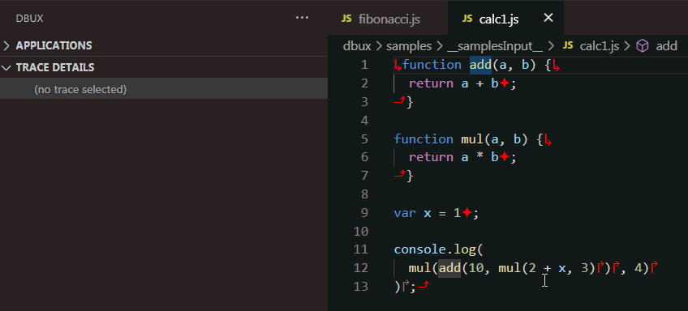
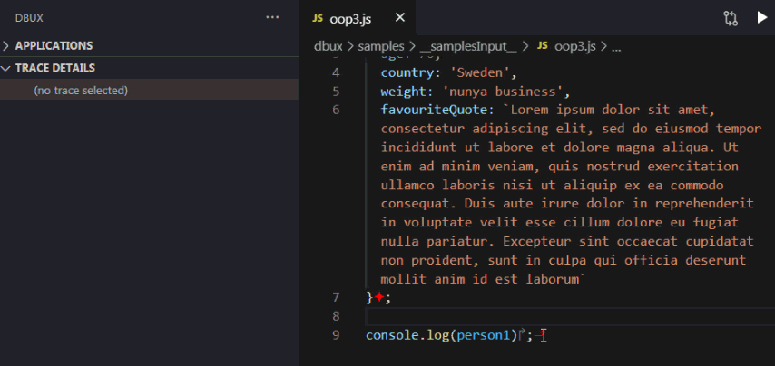

[](https://marketplace.visualstudio.com/items?itemName=Domi.dbux-code)
[](https://marketplace.visualstudio.com/items?itemName=Domi.dbux-code)
[](https://discord.gg/QKgq9ZE)
[](https://opensource.org/licenses/Apache-2.0)

<h2>Table of Contents</h2>

[[TOC]]


# Installation

You can one-click install the plugin from the [VSCode marketplace](https://marketplace.visualstudio.com/items?itemName=Domi.dbux-code). You can also install it from within VSCode via the "Extensions" panel.

[You can learn more about Dbux here](https://github.com/Domiii/dbux).


# Usage

In order to get started, you probably want to use the "Run with Dbux" button.

Once your program has run, you can analyze it in great detail, as described below.

If you have a build pipeline, and cannot just run it via `node myProgram.js`, refer to "[Adding Dbux to your build pipeline](../#adding-dbux-to-your-build-pipeline)".


##  "Run with Dbux" and "Debug with Dbux"

* The "Run with Dbux" button is the easiest way to get started with Dbux
   * It is located in multiple places:
      1. In the top right (to the right of your editor tabs)
      1. In the Dbux view container at the top of the "Applications" view
         * NOTE: You have to move mouse over it to see it. That's a VSCode limitation.
      1. In the Dbux view container at the top of the "Trace Details" view
         * (same asterisk applies)
   * The button calls the "*Dbux: Run current file*" command.
* The "Debug with Dbux" button does the same thing as the Run button but with `--inspect-brk` enabled.
   * Make sure to turn on VSCode's Auto Attach for this.
   * For more information, consult [the official manual on "Node.js debugging in VS Code"](https://code.visualstudio.com/docs/nodejs/nodejs-debugging).

### How the Run + Debug buttons work

* When you click either button (or use the "*Dbux: Run current file*" command), what happens is: [@dbux/cli](../dbux-cli) runs the currently open JS file (with the [@dbux/runtime](../dbux-runtime) injected), tracing and recording runtime information as it executes.
* You can configure both buttons in your workspace or user settings. See [Configuration](#configuration) for more details.
* NOTE: Dbux architectural details are explained [here](../#dbux-architecture).


# Analyzing our program's Runtime

This extension provides the following visual aids and interactions to engage in JavaScript runtime analysis:


## Code decorations

* Code that you ran with Dbux will be rendered with decorations.
* These decorations allow us to better understand which parts of the code actually executed.
* You can toggle these decorations via the `Dbux: Hide Decorations` and `Dbux: Show Decorations` commands.

Examples:

* In this buggy code, we find that line 6 never executed, just by looking at the code decorations:
   


## Applications

The "Applications" view is at the top of the Dbux view.

* This allows you to manage (enable/disable) all Dbux-enabled JavaScript applications.
   * A new application will show up, once the first batch of an executed program's runtime data has been received.
   * Executions of the same entry point file will be grouped together, and replace one another, when a new execution comes along.
* You can click an application to enable/disable it.
   * Disabled applications will not be visible to inspection. Only enabled applications:
      1. Allow [trace selection](#trace-selection)
      1. Render [code decorations](#code-decorations)
      1. Show up in the [Call Graph](#call-graph)
* Activating multiple applications at once can be useful for full-stack debugging purposes.
   * When multiple applications are running at the same time, their Call Graphs will be (crudely) merged and can be viewed as one.


## Trace Selection



* Code that has executed can be traced and analyzed (executed code is rendered with [code decorations](#code-decorations) (if enabled)).
* To select a trace, place the keyboard cursor on executed code and then press the "Select Trace" button
   * NOTE: Keywords like `if` and `return` cannot currently be selected, however their conditions/arguments etc can.
* Press repeatedly to select surrounding traces (as shown in the gif above).

## Trace Details

Analyze and navigate through individual traces:

### Trace Details: Navigation

Navigation allows you to step through all recorded traces (similar to but a lot more advanced than) the traditional debugger.


TODO: short video

Important: The buttons will only show up if you select them, or hover over them with the mouse (this is a VSCode limitation).

Since we are not debugging in real-time, but work on a recoding of the actual execution, we can:

1. step forward and also *backward* in time, meaning that all navigation modes exist twice (one forward, one backward).
1. (to some extent) smart (not entirely stupid) steps

Here are all the buttons:

   `Go to start/end of context`

* Jump to the start/end of the current context (function or file)
* When pressed again, steps out to caller (or in "call graph" lingo: to the "parent")

  `Go to previous/next function call in context`

* Jump to previous/next *traced* function call <span style="color:red">↱</span> before/after the currently selected trace.
   * Note that library or native calls <span style="color:gray">↱</span> are not traced and thus will be ignored by this button.
* When pressed again, steps into that function.
* NOTE: Things might be a bit off in case of [getters and setters](https://www.w3schools.com/js/js_object_accessors.asp)
   * Since getters and setters don't have a clearly identifyable caller, they need a lot of extra work before they will be fully smoothed out.

  `Go to previous/next trace in context`

* Jump to previous "non-trivial" trace
   * We use some basic heuristics to ignore some "trivial traces".
   * Ex1: In case of `a.b`, it will step to `a.b`, but it will not step to `a`.
   * Ex2: In case of `b.f(1, 2);`, it will step straight to `b.f(x, y)`, and will ignore `b`, `b.f`, `x` and `y`, etc.


  `Go to previous/next execution of the same trace`

* If a piece of code was executed multiple times (because a function was called multiple times, loops etc), this allows you to jump between the traces of those different executions.


  `Go to previous/next trace (unconditionally)`

* Go to previous/next trace, no matter what.
* These buttons provide the most granular navigation option.
* Use it if you want to understand what exactly happened, as these buttons will follow the exact control flow of your program, visiting every expression and statement, not ignoring anything.


### Trace Details: Value



If your currently selected trace is an expression with a value other than `undefined`, that value will be rendered here.

You can inspect a value by clicking on it.

NOTE: You might want to read up on [value limitations and problems](
../#problems-with-values).


### Trace Details: Object traces

* Non-primitive values are tracked and correlated via a `Map`, meaning that any value that occurs anywhere in your program can be tracked throughout the program.
* All non-primitive traces that have the same value ("sameness" defined by the JS built-in `Map`) can be looked up this way.

This allows us find any occurence of an object and its evolution throughout the execution of the program, like in the example screengrab below:


### Trace Details: Trace Executions

TODO

### Trace Details: Nearby Values

TODO

### Trace Details: Debug

Shows raw data related to the selected trace.

This is generally only useful for people who want to contribute to Dbux or are otherwise interested in analyzing raw JS runtime data.

## Call Graph

Bird's Eye overview over all executed files and functions.

TODO

### Call Graph: Visualization

TODO: Run + Context nodes

### Call Graph: pause (pause/resume live updates)

TODO

### Call Graph: clear (show/hide already recorded traces)

TODO

### Call Graph: sync (toggle sync mode)

TODO

### Call Graph: loc (show/hide locations)

TODO

### Call Graph: call (show/hide caller trace)

TODO

### Call Graph: Search

TODO

## Finding Errors

If a thrown error has been recorded, the "Error" button will show up at the top right in VSCode (to the right of the editor tabs).

TODO

## Practice

* currently hidden behind a command
* allow practicing dbux and, more generally, debugging on real-world projects and their bugs.


# Commands

TODO: clean this up and update all missing commands
TODO: explain keyboard shortcuts

How to execute VSCode commands:
1. Press `CTRL/Command + Shift + P`
1. Search for a command... (just type)
1. Select the command (`Enter`)


A rough outline of (hopefully all) commands:

### Dbux: Run File
Runs the currently open file with Dbux enabled.

### Dbux: Debug File
Runs the currently open file with Dbux enabled and Node's `--inspect-brk` turned on.

NOTE: Make sure to enable [VSCode's Auto Attach](https://code.visualstudio.com/docs/nodejs/nodejs-debugging#_auto-attach-feature) or attach a debugger manually (e.g. via an [`attach` launch option](https://code.visualstudio.com/docs/editor/debugging#_launch-versus-attach-configurations) or `chrome://inspect`) after running the command.

### Dbux: Export application data
Select and save an application as a JSON file.

### Dbux: select trace
Select trace by application name and traceId.

### Dbux: Call Graph
Open Dbux Call Graph.

### Dbux: Show decorations
Show decorations in file.

### Dbux: Hide all decorations
Hide decorations in file.

### Dbux: Toggle all navigation buttons
Show/Hide all Dbux's buttons on the upper right corner.

### Dbux: Toggle all error log
Show/Hide all Dbux's error messages.

### Dbux Practice: Cancel All
Stop activating bug.


# Configuration

These are all currently supported configuration parameters (mostly for the "Run with Dbux" and "Debug with Dbux" buttons/commands):

(You can open configuration via `CTRL/Command + Shift + P` -> "Open {User,Workspace} Settings")

```json
"configuration": [
   {
      "title": "Dbux",
      "properties": {
         "dbux.run.dbuxArgs": {
         "type": "string",
         "default": "--esnext",
         "description": "Custom `dbux run` command options. You can find a list of all available dbux command options by running `npx dbux run --help` or by looking at the sourcecode in [dbux-cli/src/commandCommons.js](../dbux-cli/src/commandCommons.js)",
         "scope": "resource"
         },
         "dbux.run.nodeArgs": {
         "type": "string",
         "default": "--enable-source-maps --stack-trace-limit=100",
         "description": "Options passed to node when running the program. Complete list at: https://nodejs.org/api/cli.html",
         "scope": "resource"
         },
         "dbux.run.programArgs": {
         "type": "string",
         "default": "",
         "description": "Custom program arguments, available to the program via `process.argv`.",
         "scope": "resource"
         },
         "dbux.run.env": {
         "type": "object",
         "default": {},
         "description": "Custom program environment variables available via `process.env` (probably not working yet).",
         "scope": "resource"
         },
         "dbux.debug.dbuxArgs": {
         "type": "string",
         "default": "--esnext",
         "description": "Custom `dbux run` command options. You can find a list of all available dbux command options in https://github.com/Domiii/dbux/blob/master/dbux-cli/src/commandCommons.js",
         "scope": "resource"
         },
         "dbux.debug.nodeArgs": {
         "type": "string",
         "default": "",
         "description": "Custom node options passed to node when running the program.",
         "scope": "resource"
         },
         "dbux.debug.programArgs": {
         "type": "string",
         "default": "",
         "description": "Custom program arguments, available to the program via `process.argv`.",
         "scope": "resource"
         },
         "dbux.debug.env": {
         "type": "object",
         "default": {},
         "description": "Custom program environment variables available via `process.env` (probably not working yet).",
         "scope": "resource"
         }
      }
   }
]
```

# How does Dbux work?

Please refer to the [main page](../#readme) for more information on how Dbux works, how to configure it, performance considerations and more.